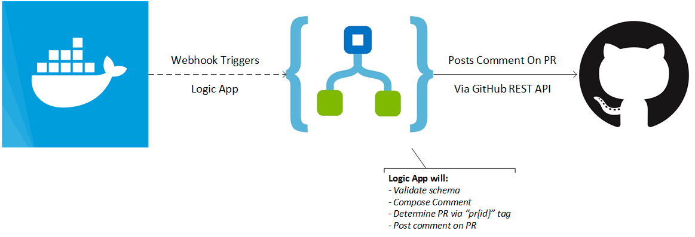

# Docker Hub Bot for GitHub Pull Requests
A bot to help you manage GitHub pull requests by posting updates on images pushed to Docker Hub for this PR.

# Prerequisits
- An Azure subscription
- Access to the Docker Hub repository
- GitHub user that will be used to post comments
- Push Docker tags in format of `pr{pr-id}`, but you can also tweak the template to use your pattern

# Deployment
1. Deploy the ARM template in `src` or use the "Deploy to Azure" button
2. Create a new webhook registration on your Docker Hub repository
3. All set!

## How it works
The bot is a simple Azure Logic App which will receive notifications from Docker Hub, interpret the information and compose a comment for the PR.

By default the Logic App will determine the PR id given it assumes to have the `pr{pr-id}` format.

If your pattern diverts from this pattern you can always tweak the bot and deploy that instead.

# License Information
This is licensed under The MIT License (MIT). Which means that you can use, copy, modify, merge, publish, distribute, sublicense, and/or sell copies of the web application. But you always need to state that Tom Kerkhove is the original author of this web application.
